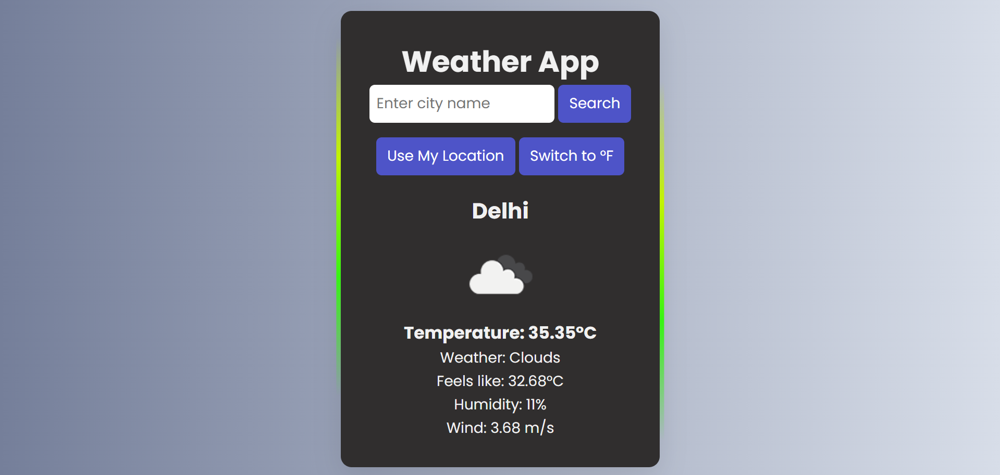

# 🌤 Weather App

A simple and responsive weather application that fetches real-time weather data using the OpenWeather API.  
Users can search for any city or use their current location to view weather information.

---

## 🚀 Features

- 🔎 Search weather by city name
- 📍 Get weather using current location (Geolocation API)
- 🌡 Toggle temperature unit (°C / °F)
- 💾 Saves last searched city using LocalStorage
- ⏳ Loading indicator while fetching data
- ❌ Error handling for invalid cities or API issues
- 🌈 Dynamic background based on weather conditions
- 🕒 Shows last updated time for weather data

---

## 🛠 Technologies Used

- HTML
- CSS
- JavaScript
- OpenWeather API
- Geolocation API
- LocalStorage

---

## 📷 Screenshot



---

## ⚙ How to Run the Project

1. Clone the repository

```
git clone https://github.com/yourusername/weather-app.git
```

2. Open the project folder.

3. Replace the API key in `script.js`:

```javascript
const apiKey = "YOUR_OPENWEATHER_API_KEY";
```

4. Open `index.html` in your browser.

---

## 🌐 Live Demo

(Add your deployed link here)

Example:

```
https://mausam-jankari-app.netlify.app/
```

---

## 📂 Project Structure

```
weather-app
│
├── index.html
├── style.css
├── script.js
├── README.md
└── screenshot.png
```

---

## 👨‍💻 Author

Rahul Jugran

GitHub: https://github.com/RahulJugran